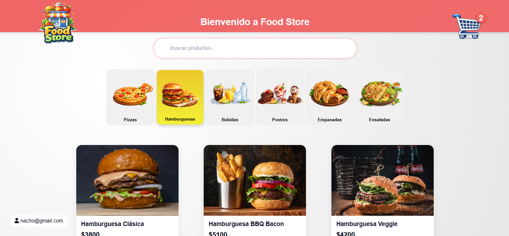

🍔 Food Store App

Aplicación web de carrito de compras para una tienda de comidas, inspirada en plataformas como PedidosYa. Desarrollada con TypeScript, HTML y CSS puro, sin uso de frameworks.

🚀 Descripción

Food Store es una app frontend que permite a los usuarios registrarse, iniciar sesión y realizar compras agregando productos a un carrito dinámico. La información se persiste en el navegador utilizando LocalStorage, tanto para los datos del usuario como para el estado del carrito.

El foco del proyecto estuvo en construir una experiencia de usuario clara, intuitiva y visualmente moderna.

🛠️ Tecnologías utilizadas
TypeScript
HTML5
CSS3
LocalStorage (Web API)
✨ Funcionalidades principales
🔐 Autenticación de usuario
Registro de nuevos usuarios
Login persistente usando LocalStorage
🛍️ Tienda de productos
Visualización de productos con imágenes claras y definidas
Página de detalle de producto
🛒 Carrito de compras
Agregado de productos con cantidad personalizada
Cálculo automático de:
Subtotales por producto
Total general
Persistencia del carrito en LocalStorage
🔔 Indicador de carrito
Notificación visual con la cantidad de productos agregados
🎨 Diseño y UX
Interfaz moderna y limpia
Uso de hovers interactivos para mejorar la experiencia
Información clara y bien jerarquizada
Diseño responsive
Enfoque en usabilidad y feedback visual al usuario
📂 Estructura general
/src
  /pages
    /auth
      login
      register
    /store
    /product-detail
    /cart
  /scripts
  /styles
index.html
💾 Persistencia de datos

La aplicación utiliza LocalStorage para:

Guardar información del usuario autenticado
Mantener el estado del carrito
Gestionar los productos agregados

Esto permite que la sesión y el carrito se mantengan incluso al recargar la página.

📸 Capturas

🔗 Demo / Repo
📦 Repositorio: (agregá acá el link a tu repo)
📌 Notas

Este proyecto fue desarrollado como parte de una evaluación académica, con el objetivo de aplicar conceptos de desarrollo frontend sin frameworks, manejo de estado y buenas prácticas de UX/UI.